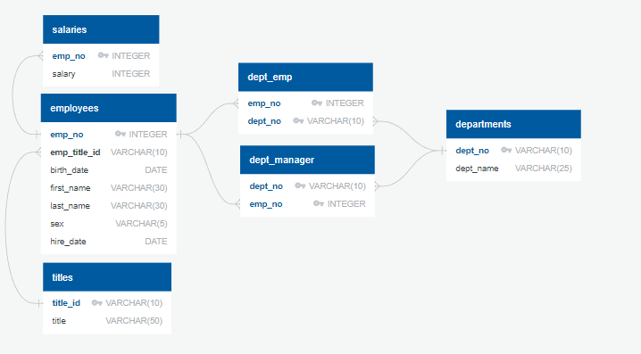

# sql-challenge

In this challenge, the task is to explore the data from employees who worked for a fictional company from the 1980's to the 1990's.

# Data Modeling

To start, an Entity Relationship Diagram (ERD) was created using https://www.quickdatabasediagrams.com/

# Data Engineering

The ERD was exported (Table Schemeta (Employee)) to create the tables. From there, the data from the 6 CSV Files (located in the CSV File folder) was imported.

# Data Analysis

Results can be found in the EmployeeSQL folder and code can be found in the Queries SQL file.
